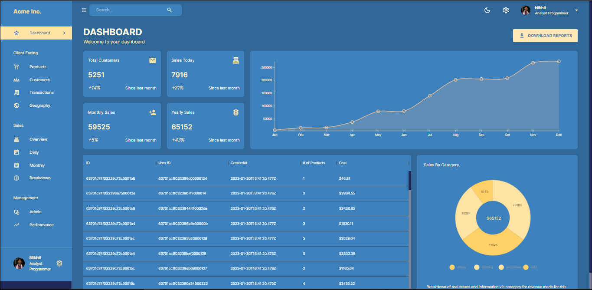
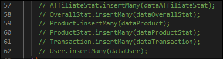

<div align="center">

## [Website](https://dashboard-frontend-c2dt.onrender.com)

[](https://dashboard-frontend-c2dt.onrender.com)

</div>

> Note : This Website is hosted using Render (Free Service). So there is a slight delay in fetching the data when we visit the website for the first time.

#

## _Setup_

Fork the repository<br />
Clone the repository

### **Frontend**:

```bash
    cd server
    npm install
    npm run dev
```

### **Backend**:

```bash
    cd client
    npm install
    npm run start
```

#

> **Note**:

Rename `.env.example` to `.env.local` in _client_ folder.
Rename `.env.example` to `.env` in _server_ folder.

Add your MongoDB URL in the .env file inside _server_ folder.

Uncomment the following lines in [index.js](server/index.js) (inside server folder) before starting Backend. This will send the data to the mongo database. Comment these lines again after first run. Remember if the Backend is started again, this will create a copy of data in the database if left uncommented. So, comment the following after starting Backend on the first run.


